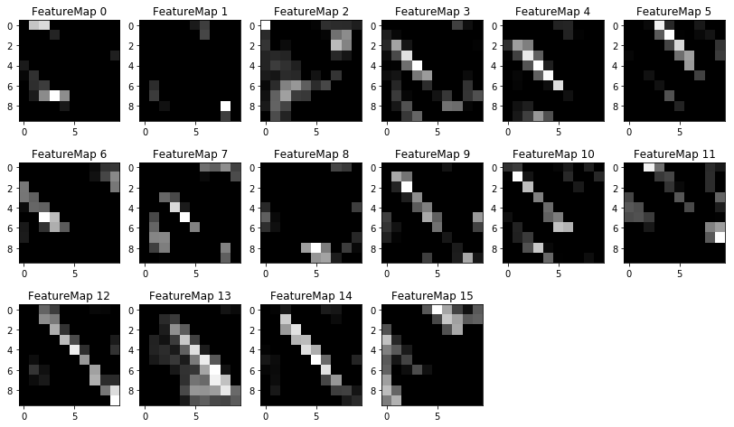

# **Traffic Sign Recognition**

## Writeup

### This is writeup of my **Traffic Sign Recognition** project

---

**Build a Traffic Sign Recognition Project**

The goals / steps of this project are the following:
* Load the data set (see below for links to the project data set)
* Explore, summarize and visualize the data set
* Design, train and test a model architecture
* Use the model to make predictions on new images
* Analyze the softmax probabilities of the new images
* Summarize the results with a written report


## Rubric Points
### Here I will consider the [rubric points](https://review.udacity.com/#!/rubrics/481/view) individually and describe how I addressed each point in my implementation.

---
## Writeup / README

### 1. Provide a Writeup / README that includes all the rubric points and how you addressed each one. You can submit your writeup as markdown or pdf. You can use this template as a guide for writing the report. The submission includes the project code.

You're reading it!

## Data Set Summary & Exploration

### 1. Provide a basic summary of the data set. In the code, the analysis should be done using python, numpy and/or pandas methods rather than hardcoding results manually.

#### Here I use a class called data to manage the dataset, I did the preprocessing in this class. Besides, the data augmentation is also performed in this class.

* First, I load the train, val, test data by function `load_data()`
* Then check the number of the data and label
* normalize the grayscale the images by function `normal_grayscale()` (Here I use the skimage to do the image process)
* Augment training data by using function `expend_training_data()`
* I wirte a function called `next_batch()` to feed random minibatch to the model

#### After data augmentation, the information of the dataset is printed by the function `print_data_info()`:

> * Number of training examples = **173995**
> * Number of validation examples = **4410**
> * Number of testing examples = **12630**
> * Image data shape = **(32, 32)**
> * Number of classes = **43**

#### 2. Include an exploratory visualization of the dataset.
I write a plot function to show the images from the dataset:


Show some images of training dataset, here we can see the result of data augmentation:


## Design and Test a Model Architecture

### 1. Describe how you preprocessed the image data. What techniques were chosen and why did you choose these techniques? Consider including images showing the output of each preprocessing technique. Pre-processing refers to techniques such as converting to grayscale, normalization, etc. (OPTIONAL: As described in the "Stand Out Suggestions" part of the rubric, if you generated additional data for training, describe why you decided to generate additional data, how you generated the data, and provide example images of the additional data. Then describe the characteristics of the augmented training set like number of images in the set, number of images for each class, etc.)

The image prepossing is done in the `data` class, which include the normalization, grayscale and data agumentation.

#### Data augmentation

The number of train-data is increased to 5 times by means of

* Random rotation : each image is rotated by random degree in ranging [-15°, +15°].
* Random shift : each image is randomly shifted by a value ranging [-2pix, +2pix] at both axises.
* Zero-centered normalization : a pixel value is subtracted by (PIXEL_DEPTH/2) and divided by PIXEL_DEPTH.


#### 2. Describe what your final model architecture looks like including model type, layers, layer sizes, connectivity, etc.) Consider including a diagram and/or table describing the final model.

In this stage, I write a class called LeNet. I have not change the structure of the LeNet model. The kernal size, input size, output size, hidden neurons are all the same with lectures. I add the following code:
* First, I used the namespace and variable space to manage the paramenters instead of the dictionary
* I write some helper function like `conv2d()`, `maxpool2d()` and `fc_layer()`
* I write some information to summary so we can use **tensorboard** to visualize
* The model is saved to a checkpoint file by using saver
* Here I use the Adam Optimizer to train the model
* the learning rate is 0.001

The structure of my model is show in the figure:


My final model consisted of the following layers:

| Layer         		|     Description	        					|
|:---------------------:|:---------------------------------------------:|
| Input         		| 32x32x1 gray image   							|
| Convolution 5x5     	| 1x1 stride, valid padding, outputs 28x28x6	|
| RELU					|												|
| Max pooling	      	| 2x2 stride,  outputs 14x14x6 				|
| Convolution 5x5	    | 1x1 stride, valid padding, outputs 10x10x16      									|
| Max pooling	  | 2x2 stride,  outputs 5x5x16  |
| RELU   |   |
| Fully connected		| inputs 5x5x16, output 120      									|
| RELU   |   |
| Dropout   |  keep: 50% |
|  Fully connected		| inputs 120, output 84   |
| RELU   |   |
| Dropout   | keep: 50%  |
|   Fully connected		| inputs 84, output 43   |
| Softmax				|     									|
|			Loss			|						cross_entropy						|


### 3. Describe how you trained your model. The discussion can include the type of optimizer, the batch size, number of epochs and any hyperparameters such as learning rate.

#### Training stage
* I train the model for 20 epoch
* The batch size I used is 128
* the model is saved to the 'model_save_dir'
* the init learning rate is set at 0.001
* I use the Adam Optimizer to train the model

#### 4. Describe the approach taken for finding a solution and getting the validation set accuracy to be at least 0.93. Include in the discussion the results on the training, validation and test sets and where in the code these were calculated. Your approach may have been an iterative process, in which case, outline the steps you took to get to the final solution and why you chose those steps. Perhaps your solution involved an already well known implementation or architecture. In this case, discuss why you think the architecture is suitable for the current problem.

My final model results were:
* validation set accuracy of 96.82%
* test set accuracy of 95.06%

If an iterative approach was chosen:
* What was the first architecture that was tried and why was it chosen?

  I just used the conventional LeNet model and have not change it at all.

* What were some problems with the initial architecture?

  It is easy to be overfit.

* How was the architecture adjusted and why was it adjusted? Typical adjustments could include choosing a different model architecture, adding or taking away layers (pooling, dropout, convolution, etc), using an activation function or changing the activation function. One common justification for adjusting an architecture would be due to overfitting or underfitting. A high accuracy on the training set but low accuracy on the validation set indicates over fitting; a low accuracy on both sets indicates under fitting.

  To overcome the overfitting problem, I add two dropout layer and set the keep prob at 0.5. Then my model has a valid accuracy more than 0.93.

* Which parameters were tuned? How were they adjusted and why?

  I add dropout and use data agumentation

* What are some of the important design choices and why were they chosen? For example, why might a convolution layer work well with this problem? How might a dropout layer help with creating a successful model?

  The dropout.

If a well known architecture was chosen:
* What architecture was chosen?

  Traditional LeNet

* Why did you believe it would be relevant to the traffic sign application?

  It is very similar to the MNIST dataset

* How does the final model's accuracy on the training, validation and test set provide evidence that the model is working well?

  the valid and test accuracy is very close and higher than 0.93


### Test a Model on New Images

#### 1. Choose five German traffic signs found on the web and provide them in the report. For each image, discuss what quality or qualities might be difficult to classify.

Here are five German traffic signs that I found on the web:


The third image might be difficult to classify because it is a little bit

#### 2. Discuss the model's predictions on these new traffic signs and compare the results to predicting on the test set. At a minimum, discuss what the predictions were, the accuracy on these new predictions, and compare the accuracy to the accuracy on the test set (OPTIONAL: Discuss the results in more detail as described in the "Stand Out Suggestions" part of the rubric).

Here are the results of the prediction:

| Image			        |     Prediction	        					|
|:---------------------:|:---------------------------------------------:|
| Road work      		| Road work   									|
| Speed limit (30km/h)     			| Speed limit (30km/h) 										|
| Slippery road					| Slippery road											|
| No entry      		| No entry					 				|
| Stop			| Stop      							|
| Children crossing   | Children crossing  |


The prediction accuracy is 100%

#### 3. Describe how certain the model is when predicting on each of the five new images by looking at the softmax probabilities for each prediction. Provide the top 5 softmax probabilities for each image along with the sign type of each probability. (OPTIONAL: as described in the "Stand Out Suggestions" part of the rubric, visualizations can also be provided such as bar charts)

The top 5 is calculate in the model:

```
[[  5.19338906e-01   3.33342195e-01   8.76728818e-02   4.26202156e-02
    9.82177630e-03]
 [  1.00000000e+00   8.05549724e-12   1.26960176e-14   4.28726212e-19
    2.54032207e-19]
 [  9.99999642e-01   1.92172621e-07   1.20765847e-07   6.99321767e-10
    1.49360888e-11]
 [  1.00000000e+00   2.52387781e-15   8.35129289e-17   1.24814110e-18
    1.33952782e-21]
 [  1.00000000e+00   1.15747916e-14   2.15361324e-15   2.09107321e-17
    5.87508132e-18]
 [  9.78278279e-01   1.32782431e-02   8.40641744e-03   2.07224057e-05
    1.62269826e-05]]
[[25 27 20 18 24]
 [ 1  0  2  3  4]
 [23 31 19 29 22]
 [17 14 34 38 12]
 [14 38 17 34  8]
 [28 30 29 24 11]]
 ```


### (Optional) Visualizing the Neural Network (See Step 4 of the Ipython notebook for more details)
#### 1. Discuss the visual output of your trained network's feature maps. What characteristics did the neural network use to make classifications?

The feature maps of the model is (for the second test image):

### After the first convolution map:


### After the first maxpool


### The second convolutional feature map result:



### The Second maxpool


